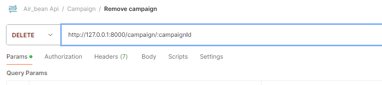

# air_bean_api

Individuellt projekt i kursen backend med Node.js för Lina Persson Signell YHFE23

# Base URL:

http://localhost:8000

# Authentication Token:

## /info

Detta anrop används för att hämta information om Air Bean. Anropet skickas som en GET-förfrågan. Om anropet lyckas returneras information om Air Bean.

### URL:

## /users/register

Detta anrop används för att registrera användare. Anropen skickas som POST-förfrågan. Man kan lägga upp vanliga användare och admin, men för att lägga upp adminanvändare måste man vara inloggad admin.

### URL:

### URL Admin:

Detta kräver autentisering.

## /users/login

Detta anrop används för att logga in användare. Anropen skickas som POST-förfrågan. OM anropet lyckas returneras bekräftelse samt en token som används som autentisering.

## /users/:userId

Detta anrop används för att se användarhistorik för en specifik användare. Anropen skickas som GET-förfrågan. OM anropet lyckas returneras vald användare orderhistorik.

### URL:

## products

Detta anrop används för att visa produktkatalog samt lägga till produkter. Anropen skickas som GET rep POST-förfrågan. OM anropet lyckas returneras bekräftelse.

### URL GET:

### URL POST:

## /products/:itemId

Detta anrop används för att redigera en product. Anropen skickas som POST-förfrågan. OM anropet lyckas returneras bekräftelse.

### URL:

## /products/campain

Detta anrop används för lägga till en kampanj. Anropen skickas som POST-förfrågan. OM anropet lyckas returneras bekräftelse.

### URL:

## /products/campain/:campaignTitle

Detta anrop används för lägga till varor en kampanj. Anropen skickas som POST-förfrågan. OM anropet lyckas returneras bekräftelse.

### URL:

## /products/campain/:campaignTitle

Detta anrop används för att ta bort en kampanj. Anropen skickas som DELETE-förfrågan. OM anropet lyckas returneras bekräftelse.

### URL:

## /carts/

Detta anrop används för att starta upp en ny kundvagn. Anropen skickas som POST-förfrågan. OM anropet lyckas returneras bekräftelse.

### URL:

## /carts/:cartId

Detta anrop används för att visa varukorgen. Anropen skickas som GET-förfrågan. OM anropet lyckas returneras varukorgen.

### URL:

## /order/login

Detta anrop används för att logga in användare. Anropen skickas som POST-förfrågan. OM anropet lyckas returneras bekräftelse samt en token som används som autentisering.

### URL:

## /orders/login

Detta anrop används för att logga in användare. Anropen skickas som POST-förfrågan. OM anropet lyckas returneras bekräftelse samt en token som används som autentisering.

### URL:

## /orders/login

Detta anrop används för att logga in användare. Anropen skickas som POST-förfrågan. OM anropet lyckas returneras bekräftelse samt en token som används som autentisering.

### URL:

### Security

All endpoints that require authentication use JWT (JSON Web Token) to secure the API

. Send the JWT token in the Authorization header with each request that requires authentication.
